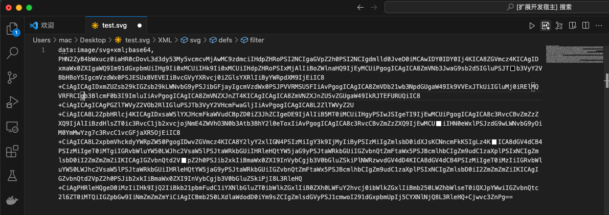
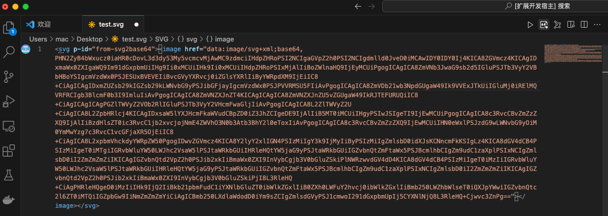

# svg2base64

Convert svg file to base64

[简体中文](./README_zh-cn.md) | English

Click the icon button shown in the following figure to convert the current SVG code to base64 encoding.

Clicking again will wrap the base64 encoding around the SVG label.

